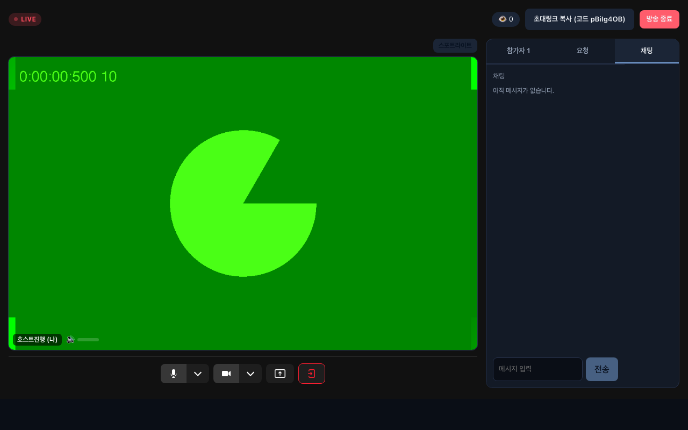
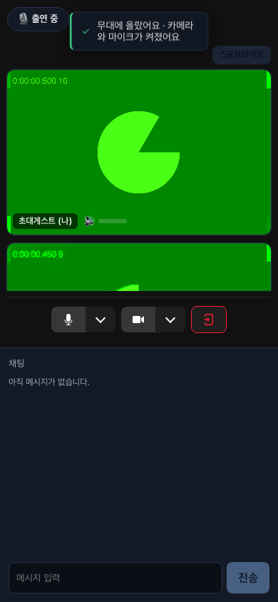
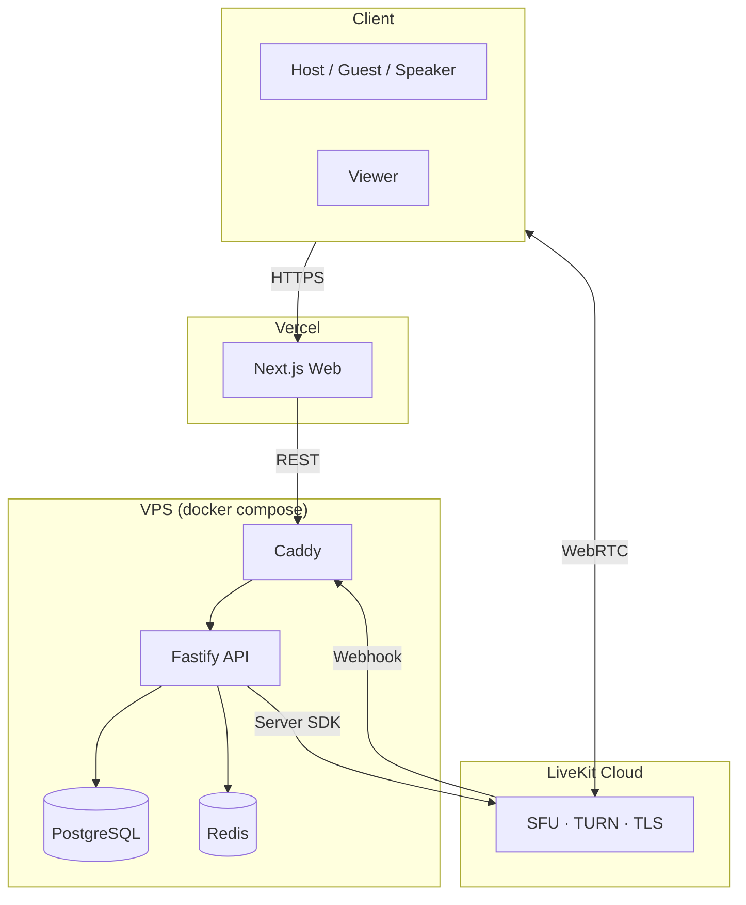

# Multi-Guest Live

[🇰🇷 한국어](README.md) · 🇬🇧 **English**

> A multi-guest live-streaming platform where a host runs the show with up to 8 guests and 20 audio-only speakers, while viewers watch over WebRTC or HLS.
> It started from a defect observed in a real fan platform — **audio that failed to reach one specific participant** — and is designed so that such a defect **cannot occur by construction · self-recovers when it does · and is caught by CI if it ever regresses.**

<!-- TODO(after deploy): demo link + 60s GIF (covering the approval moment → glow-ring segment) -->
**🔴 Live demo**: _(deploying — Phase 7b)_ · **Docs**: [design index](#documentation)

[](https://github.com/hjryoo-ai/multi-guest-live/actions/workflows/ci.yml)
[](LICENSE)

<p align="center">
  
  &nbsp;&nbsp;
  
</p>
<p align="center"><sub>Host operator view (desktop) · guest approval moment (mobile) — real E2E screenshots (<code>docs/screenshots/</code>)</sub></p>

---

## Core: guaranteed audio reach

The project's central design invariant is **"every audio track being published reaches every participant."** It is implemented with three layers of defense:

1. **Structural prevention** — Media routing is delegated entirely to the SFU (LiveKit); app code never manages peer connections directly. Audio is always subscribed by everyone (`autoSubscribe`), and promotion/demotion goes through the single `updateParticipant` path.
2. **Detection & self-recovery** — Every client reports the audio tracks it is subscribed to on a 10-second cycle (`AUDIO_RX_REPORT`) → the server compares that against the publish set → on a miss it instructs the client to re-subscribe, and if still unresolved it flags that participant's tile on the host's screen.
3. **Regression blocking** — E2E tests assert "every participant's subscribed-audio count == expected" across join-order permutations, mid-session leaves, and kick scenarios. A direct regression test for the original observed bug (the 2nd guest's audio not reaching the host) is pinned to the PR gate.

## Features

- **Role model**: host / guest (video + audio, 8) / speaker (audio-only, 20) / viewer — approval queue, real-time promotion & demotion with no reconnect (server force-reclaims video on demotion)
- **Two viewing paths**: Mode A (WebRTC, low latency) / Mode B (Egress → HLS + CDN, large scale) — identical viewer UI
- **Operator tools**: mute · kick · role switch · chat hide/ban, with a full audit log on every action
- **Chat**: unified through the server (single source of truth for ordering), rate-limit & profanity hooks, per-mode propagation (signal push / polling snapshot)
- **Stability**: grace-period room end when the host drops, reconnect guard (prevents duplicate-login ping-pong), graceful shutdown, `/metrics`
- **Demo mode**: env flags control room caps · lifetime · data retention; one-click demo start + QR so even a lone visitor can experience the full loop

## Architecture



Local development uses self-hosted LiveKit (the OSS container) with the same code — switching between Cloud and self-host is env-only.

## Engineering highlights

- **Every change enters main only through a PR that passes the verify script chain (Phase 1–7) + the 16-test E2E gate** — `enforce_admins` blocks direct pushes, admins included
- **Single-path principle**: promotion is one fast-path, room teardown is one `endRoomGracefully` (structurally rules out "second-path bugs" such as a missed egress stop)
- **Signal-spoofing blocked**: data-channel server signals are guarded by sender verification (`isServerSignal`) — a participant cannot broadcast a fake "room ended" or forge a chat-hide (E2E-pinned)
- **Found & fixed a rate-limit bypass**: `trustProxy: true` was trusting the leftmost `X-Forwarded-For` → replaced with hop-count-based trust, verifying both the forged and the untrusted matrices in isolation
- **Zero-rerender glow ring**: the speaking indicator (the signature UI) is built off the volume → setState path using rAF + CSS variables — zero re-renders as a design property, not throttling
- Chat micro-cache (≤ 1 qps to the DB per room, independent of viewer count) · HLS caching headers · signal-forgery E2E · SIGTERM graceful shutdown

## Running locally

```bash
# Requires: Node 20+, pnpm, Docker
cp .env.example .env
docker compose up -d          # livekit(OSS) + postgres + redis
pnpm install
pnpm --filter @multi-live/api db:migrate
pnpm dev                      # api :4000 + web :3000
```

Full verification: `pnpm -r typecheck` · the verify chain (`pnpm --filter @multi-live/api verify:phase1` ~ `verify:phase7`) · `pnpm --filter @multi-live/web e2e` (gate of 16).

## Documentation

| Document | Contents |
|---|---|
| [`multi-guest-live-design.md`](multi-guest-live-design.md) | Full Phase 0–7 design (features → hardening → UI → deployment) |
| [`docs/testid-contract.md`](docs/testid-contract.md) | E2E selector contract (preservation rules when the UI changes) |
| [`docs/hardening-report.md`](docs/hardening-report.md) | Security · performance · stability measures and their measurements |
| [`docs/branching.md`](docs/branching.md) | Branch strategy · canonical gate definition · rollback procedure |
| [`docs/production-notes.md`](docs/production-notes.md) | **"If this were production"** — intentional non-implementations (real auth, self-run TURN, the single-room scaling limit and its tiering strategy) and the reasoning |

## Stack

LiveKit (SFU/WebRTC) · Fastify + TypeScript · Next.js 15 · PostgreSQL (drizzle) · Redis · Playwright · Docker · GitHub Actions

## License

MIT
