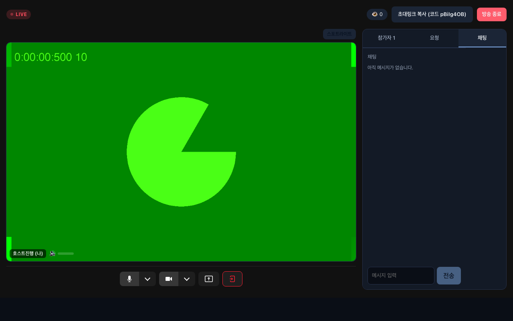
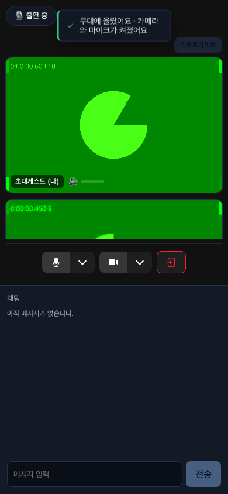
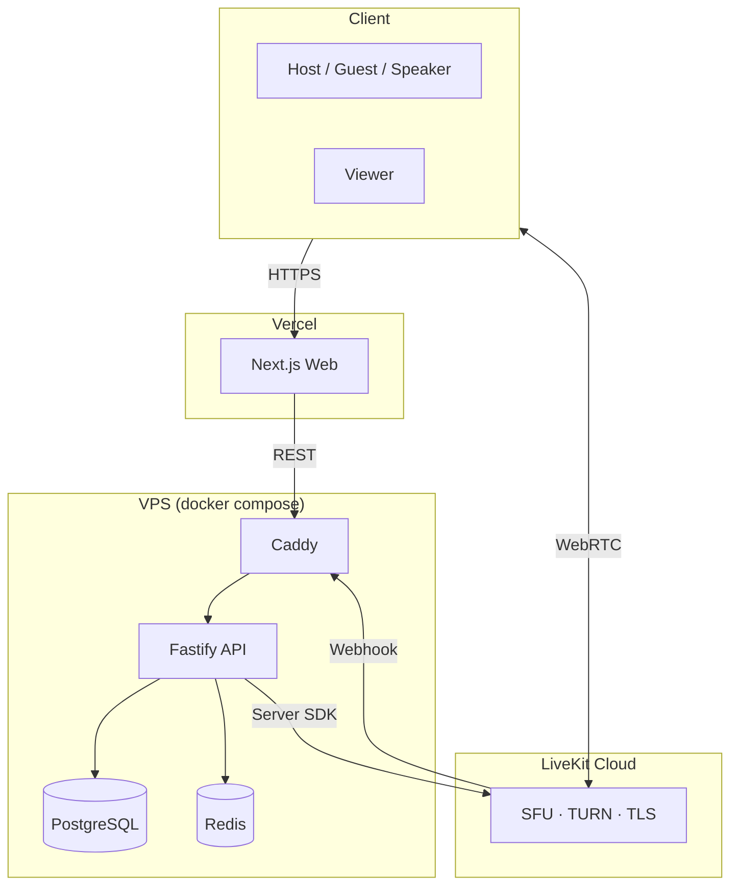

# Multi-Guest Live

> 호스트 + 게스트 8명 + 음성 참여자 20명이 함께 진행하고, 시청자가 WebRTC 또는 HLS로 관전하는 멀티 게스트 라이브 스트리밍 플랫폼.
> **"특정 참가자에게만 음성이 안 들리는" 실제 팬 플랫폼의 결함을 관찰한 데서 출발해, 그런 결함이 구조적으로 발생할 수 없고 · 발생하면 자동 복구되며 · 회귀하면 CI가 잡는 시스템**을 목표로 설계했습니다.

<!-- TODO(배포 후): 데모 링크 + 60초 GIF (승인 모먼트 → 글로우 링 구간 포함) -->
**🔴 라이브 데모**: _(배포 준비 중 — Phase 7b)_ · **문서**: [설계 문서 인덱스](#문서)

[](https://github.com/hjryoo-ai/multi-guest-live/actions/workflows/ci.yml)
[](LICENSE)

<p align="center">
  
  &nbsp;&nbsp;
  
</p>
<p align="center"><sub>호스트 운영 화면(데스크톱) · 게스트 승인 모먼트(모바일) — 실제 E2E 스크린샷(<code>docs/screenshots/</code>)</sub></p>

---

## 핵심: 오디오 전수 도달 보장

이 프로젝트의 중심 설계 불변식은 **"publish 중인 모든 오디오는 모든 참가자에게 도달한다"** 입니다. 3중 방어로 구현됩니다:

1. **구조적 예방** — 미디어 라우팅을 SFU(LiveKit)에 전적으로 위임하고 앱 코드가 피어 연결을 직접 관리하지 않음. 오디오는 항상 전원 구독(`autoSubscribe`), 승격·강등은 `updateParticipant` 단일 경로.
2. **감지·자동 복구** — 각 클라이언트가 10초 주기로 자신이 구독 중인 오디오 트랙을 보고(`AUDIO_RX_REPORT`) → 서버가 publish 집합과 대조 → 누락 시 해당 클라이언트에 재구독 지시, 미해결 시 호스트 화면의 해당 참가자 타일에 경고.
3. **회귀 차단** — 입장 순서 조합·중도 퇴장·강퇴 시나리오별 E2E가 "모든 참가자의 구독 오디오 수 == 기대값"을 어서션. 원 관찰 버그(2번째 게스트 음성이 호스트에게 미도달)의 직접 회귀 테스트가 PR 게이트에 고정되어 있습니다.

## 기능

- **역할 모델**: host / guest(영상+음성, 8) / speaker(음성 전용, 20) / viewer — 승인 큐, 재연결 없는 실시간 승격·강등(강등 시 서버 강제 비디오 회수)
- **시청 이원화**: 모드 A(WebRTC, 저지연) / 모드 B(Egress→HLS+CDN, 대규모) — 동일 시청 UI
- **운영 도구**: 음소거·강퇴·역할 전환·채팅 숨김/차단, 전 액션 감사 로그
- **채팅**: 서버 경유 단일화(순서의 단일 진실), rate limit·금칙어 훅, 모드별 전파(신호 push / 폴링 스냅샷)
- **안정성**: host 이탈 유예 종료, 재연결 가드(중복 로그인 핑퐁 방지), graceful shutdown, `/metrics`
- **데모 모드**: env 플래그로 방 상한·수명·데이터 보존 제어, 원클릭 데모 시작 + QR로 1인 방문자도 풀 루프 체험

## 아키텍처



로컬 개발은 동일 코드로 self-host LiveKit(OSS 컨테이너)을 사용합니다 — Cloud/self-host 전환은 env뿐.

## 엔지니어링 하이라이트

- **모든 변경은 verify 스크립트 체인(Phase 1~7) + E2E 16 게이트를 통과한 PR로만 main에 진입** — `enforce_admins`로 관리자 포함 직접 push 차단
- **경로 단일화 원칙**: 승격은 fast-path 하나, 방 종료는 `endRoomGracefully` 하나(egress 정지 누락 같은 "두 번째 경로 버그"를 구조로 차단)
- **신호 스푸핑 차단**: data channel 서버 신호를 발신자 검증(`isServerSignal`)으로 가드 — 참가자가 가짜 "방 종료"·채팅 위조 숨김을 브로드캐스트할 수 없음 (E2E 고정)
- **rate limit 우회 취약점 발견·수정**: `trustProxy: true`가 X-Forwarded-For leftmost를 신뢰하던 결함 → 홉 수 기반 신뢰로 교체, 위조/미신뢰 매트릭스 양쪽을 격리 검증
- **리렌더 0 글로우 링**: 발화자 표시(시그니처 UI)를 볼륨→setState 경로 제거 + rAF/CSS 변수로 구현 — 스로틀이 아니라 설계 성질로 리렌더 0
- 채팅 마이크로 캐시(시청자 수와 무관하게 방당 DB ≤1qps) · HLS 캐싱 헤더 · 신호 위조 E2E · SIGTERM graceful shutdown

## 로컬 실행

```bash
# 요구: Node 20+, pnpm, Docker
cp .env.example .env
docker compose up -d          # livekit(OSS) + postgres + redis
pnpm install
pnpm --filter @multi-live/api db:migrate
pnpm dev                      # api :4000 + web :3000
```

전체 검증: `pnpm -r typecheck` · verify 체인(`pnpm --filter @multi-live/api verify:phase1` ~ `verify:phase7`) · `pnpm --filter @multi-live/web e2e` (게이트 16).

## 문서

| 문서 | 내용 |
|---|---|
| [`multi-guest-live-design.md`](multi-guest-live-design.md) | Phase 0~7 상세설계 (기능 → 하드닝 → UI → 배포) |
| [`docs/testid-contract.md`](docs/testid-contract.md) | E2E 셀렉터 계약 (UI 변경 시 보존 규칙) |
| [`docs/hardening-report.md`](docs/hardening-report.md) | 보안·성능·안정성 조치와 측정치 |
| [`docs/branching.md`](docs/branching.md) | 브랜치 전략 · 게이트 정본 · 롤백 절차 |
| [`docs/production-notes.md`](docs/production-notes.md) | **"프로덕션이라면"** — 의도적 미구현(실인증·TURN 자가운영·단일 방 확장 한계와 티어링 전략)과 그 근거 |

## 스택

LiveKit (SFU/WebRTC) · Fastify + TypeScript · Next.js 15 · PostgreSQL (drizzle) · Redis · Playwright · Docker · GitHub Actions

## License

MIT
